# AWS Serverless API using Lambda and API Gateway

This project demonstrates a step-by-step implementation of a **Serverless HTTP API**
using **AWS Lambda** and **Amazon API Gateway**.
Each step includes clear explanations and screenshots for better understanding.

---

## Step 1: Login to AWS Console

- Logged into the **AWS Management Console** using an **IAM user** account.
- After successful login, the **AWS Console Home** page is displayed.
- The region is set to **US East (N. Virginia)**, which will be used for creating AWS resources in this project.
- From the Console Home, AWS services such as **EC2, S3, RDS, and Lambda** can be accessed using the search bar or service links.

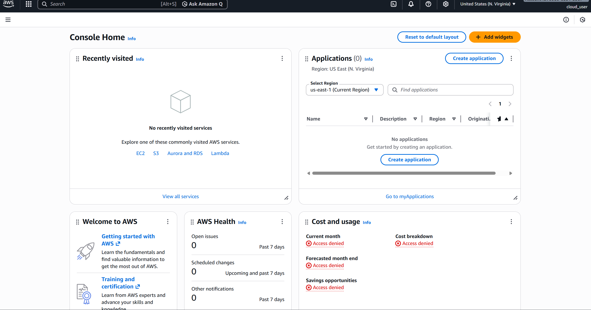

---

## Step 2: Search for AWS Lambda Service

- Used the **search bar** at the top of the AWS Management Console.
- Typed **“Lambda”** to find the AWS Lambda service.
- AWS displays Lambda under the **Services** section with the description *“Run code without thinking about servers”*.
- This step is required to navigate to the Lambda service, where serverless functions will be created.

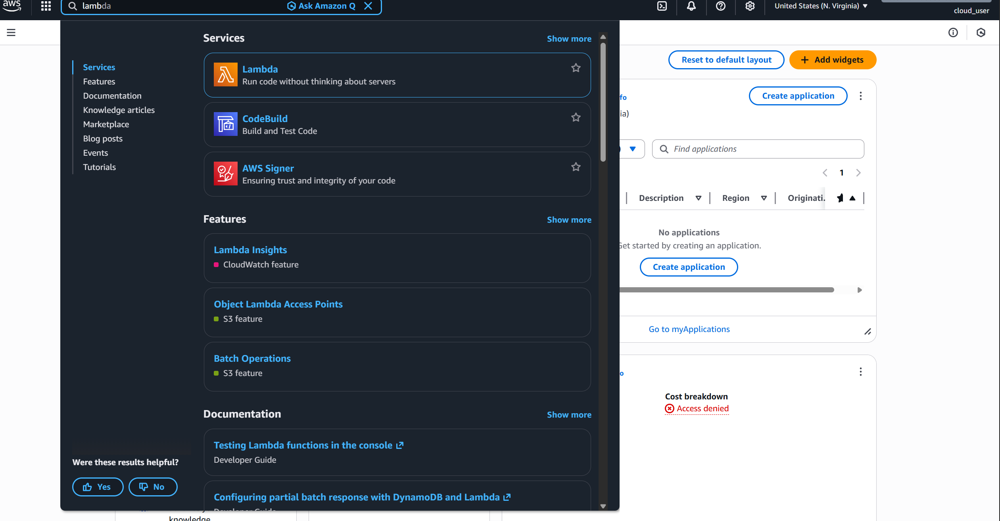

---

## Step 3: Open AWS Lambda Console

- After selecting **AWS Lambda** from the search results, the Lambda service console is opened.
- The Lambda console provides an overview of how AWS Lambda works and supported runtimes such as **Node.js, Python, Java**, etc.
- From this page, users can create and manage serverless functions.
- Click the **Create a function** button to start building a new Lambda function.

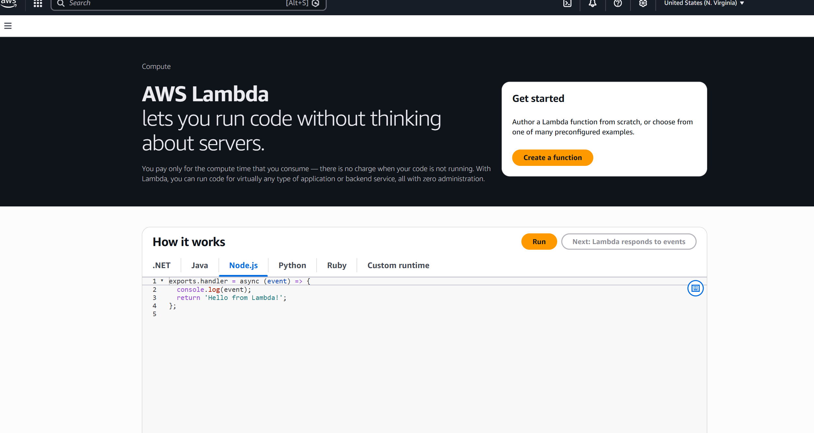

---

## Step 4: Create a New Lambda Function

- Clicked on **Create a function** in the AWS Lambda console.
- Selected **Author from scratch** to create a custom Lambda function.
- Entered a meaningful **Function name** to identify the Lambda function.
- Chose **Node.js** as the runtime for implementing the serverless logic.
- Selected the default **x86_64 architecture**.
- Allowed AWS to create a default **execution role** with permissions to write logs to CloudWatch.

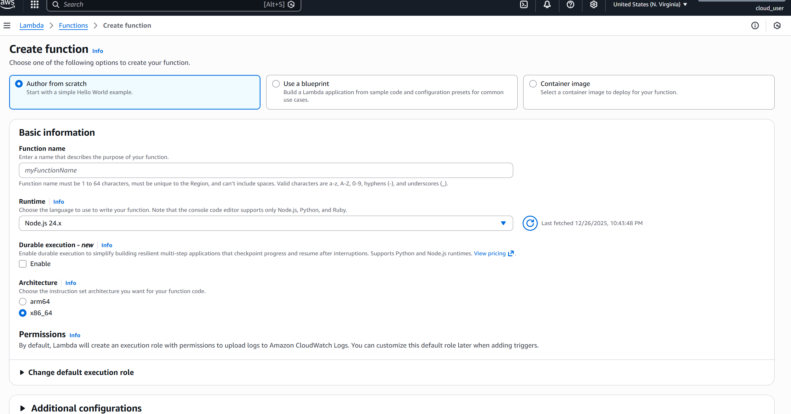

---

## Step 5: Configure Runtime, Architecture, and Execution Role

- Selected **Node.js** as the runtime for the Lambda function.
- Kept the default **Node.js 24.x** version.
- Chose **x86_64** as the architecture for compatibility.
- Left **Durable execution** disabled since this is a simple API function.
- Used the default execution role option so AWS automatically manages basic permissions.
- This execution role allows the Lambda function to write logs to **Amazon CloudWatch Logs**.

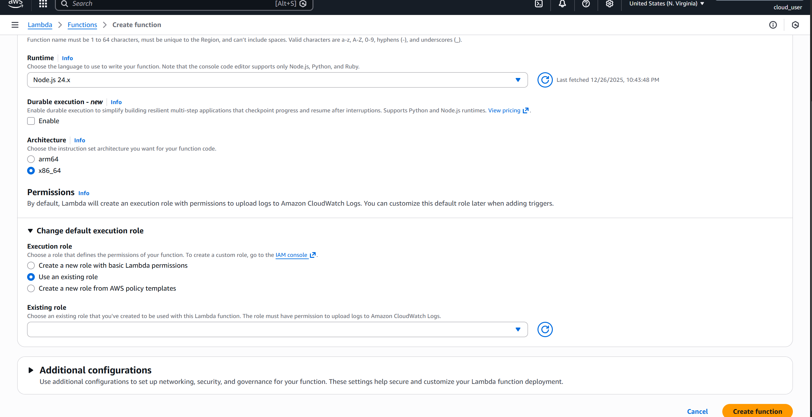

---

## Step 6: Select Existing Execution Role and Create Function

- Selected **Use an existing role** for the Lambda execution role.
- Chose the existing IAM role **OrderUpLambdaExecutionRole**.
- This role already has permissions to write logs to **Amazon CloudWatch Logs**.
- Clicked **Create function** to finish creating the Lambda function.

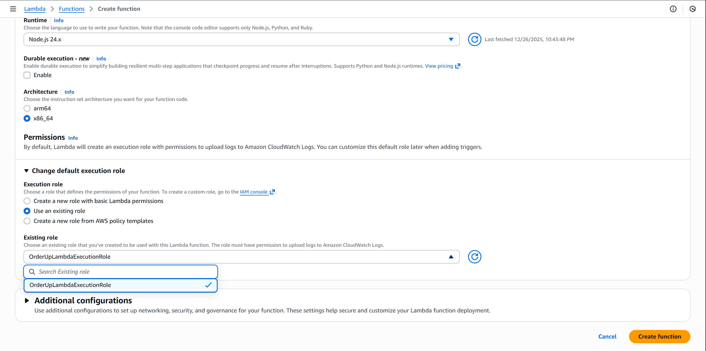

---

## Step 7: Lambda Function Successfully Created

- The Lambda function **functionorder** was successfully created.
- AWS shows a confirmation message indicating the function is ready.
- The **Function overview** page displays:
  - Function name
  - Function ARN
  - Region
- From this page, code can be edited and triggers (such as API Gateway) can be added.

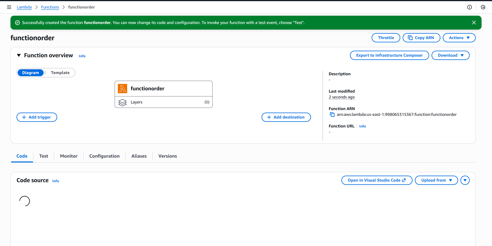

---

## Step 8: Write Lambda Function Code

- Opened the **Code** tab of the Lambda function.
- The default file **index.mjs** is used for writing the Lambda handler.
- Implemented logic to:
  - Parse the incoming request body
  - Store order details in **Amazon DynamoDB**
  - Return a success or error response
- The function uses **AWS SDK v3** to interact with DynamoDB.

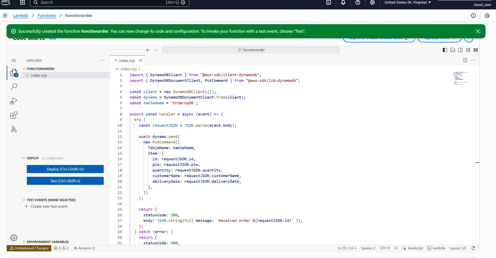

---

## Step 9: Test the Lambda Function

- Created a **new test event** in the Lambda console.
- Provided sample JSON input to simulate an API request.
- Executed the function using the **Test** button.
- Verified that the function:
  - Executes successfully
  - Returns a proper response
  - Logs execution details in CloudWatch

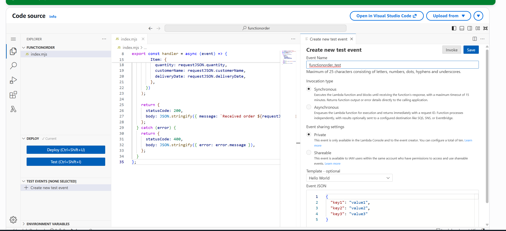

---

## Step 10: Update and Test Lambda Function Code

- Updated the Lambda function code in **index.mjs**.
- Implemented logic to parse request data and store order details in **Amazon DynamoDB**.
- Used **AWS SDK v3** (`PutCommand`) for database interaction.
- Deployed the updated code.
- Created a test event with sample JSON input.
- Successfully tested the function and received a **200 OK** response.

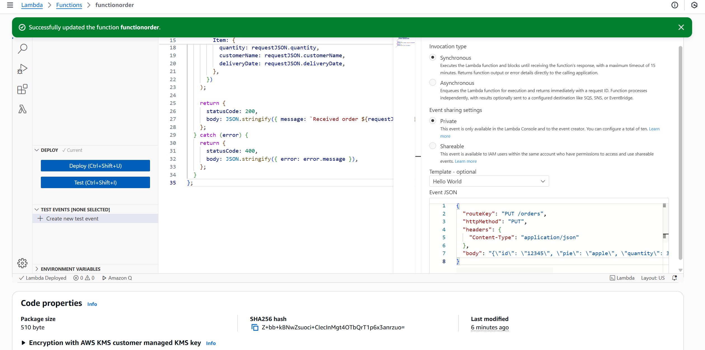

---

## Step 11: Test Lambda Function Using Test Event

- Created a test event named **functionorder_test**.
- Provided sample JSON input to simulate an order request.
- Executed the Lambda function using the **Test** option.
- The function returned **HTTP 200 OK**, confirming successful execution.
- This verifies that the Lambda logic works correctly before integrating with API Gateway.

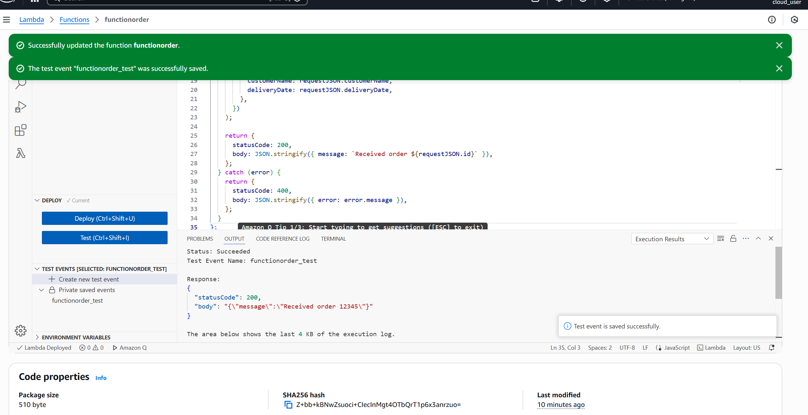

---

## Step 12: Create GET Order Lambda Function

- Created a Lambda function to retrieve an order by ID from DynamoDB.
- The function reads the order ID from the API path parameter.
- If the order exists, it returns the order details.
- If not found, it returns a 404 response.

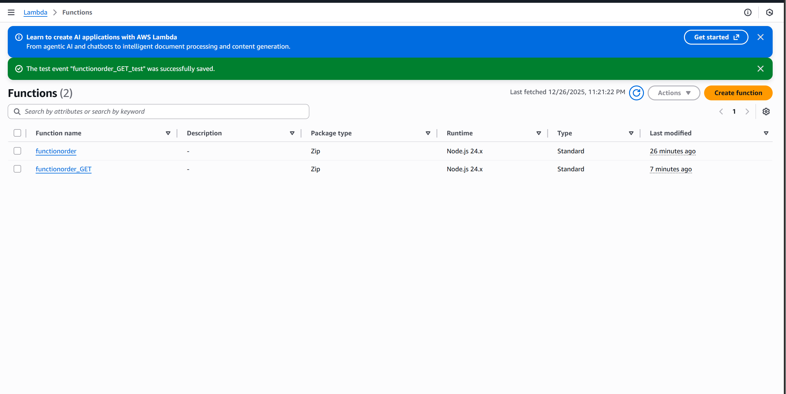

---

## Step 13: Create and Test DELETE Lambda Function

- Created a Lambda function named **functionorder_DELETE** to delete an order from DynamoDB.
- This function uses the **order ID** received from the API path parameter.
- The Lambda deletes the corresponding item from the DynamoDB table.
- A test event named **functionorder_DELETE_Test** was created.
- The test event includes the order ID to be deleted.
- The function was executed using the **Test** option.

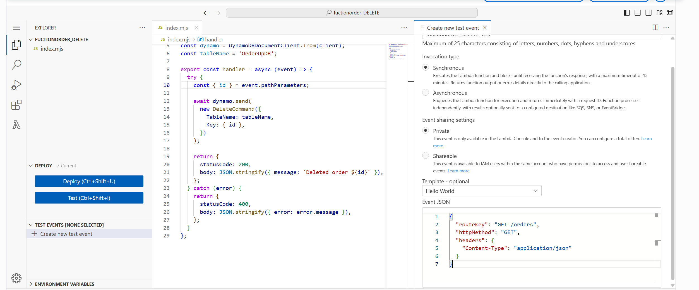

## Step 14: Open API Gateway

API Gateway was opened from the AWS console.
It will be used to create REST APIs that connect HTTP methods
(GET, PUT, DELETE) with the Lambda functions created earlier.

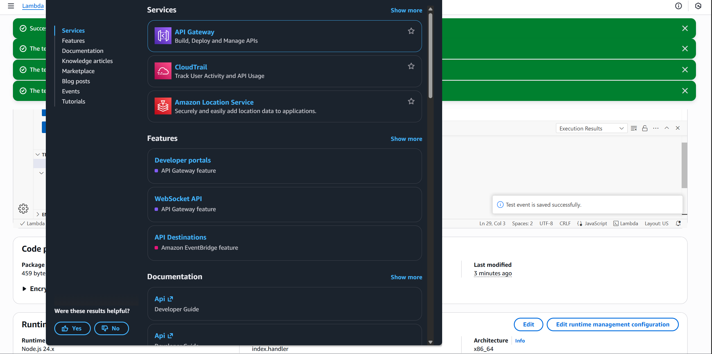

## Step-15:open API Gateway

This screenshot shows the AWS API Gateway service opened from the console.
API Gateway is used to expose Lambda functions as HTTP endpoints.
It will be used to connect PUT, GET, and DELETE Lambda functions.

## Step-17:API Gateway Lambda Integrations

This screenshot shows Lambda functions added as integrations in API Gateway.
PUT, GET, and DELETE Lambda functions are connected to the HTTP API.
This allows API Gateway to route requests to the correct Lambda function.

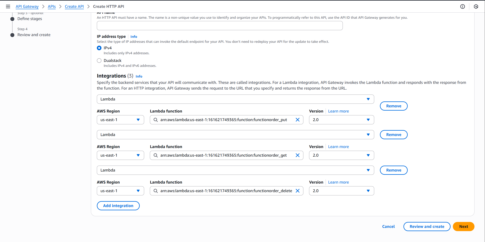

